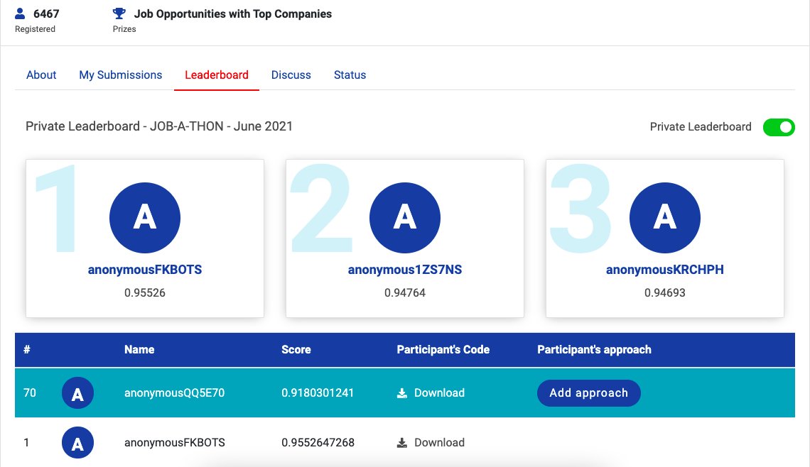
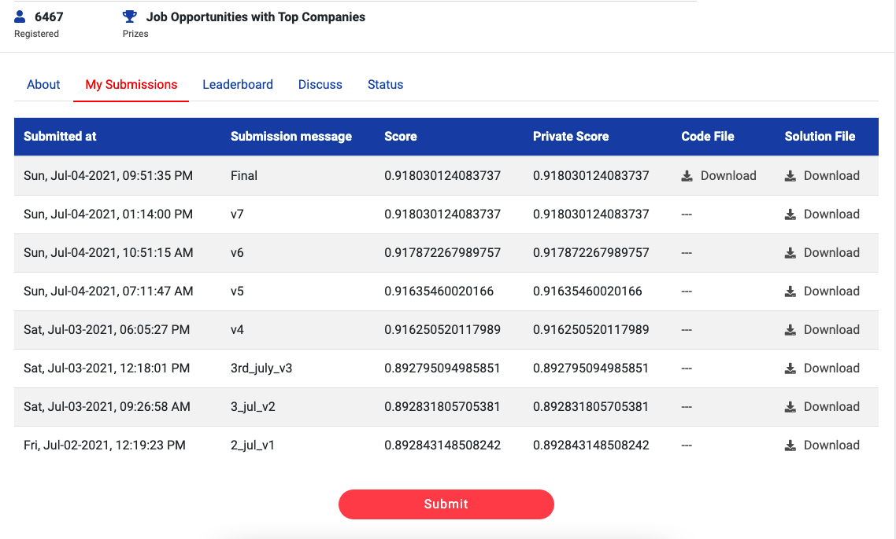
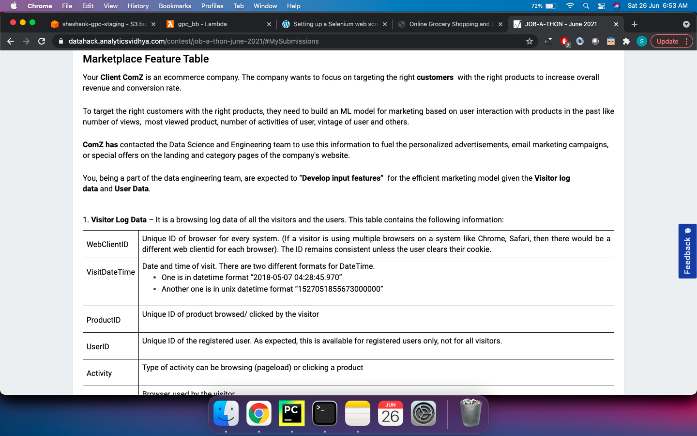
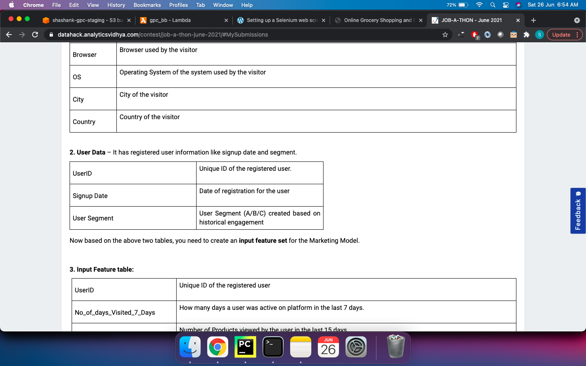
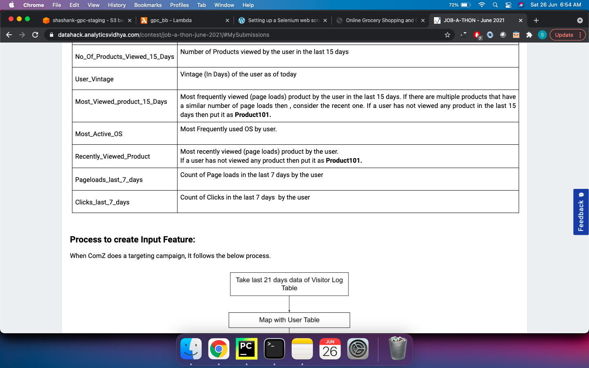
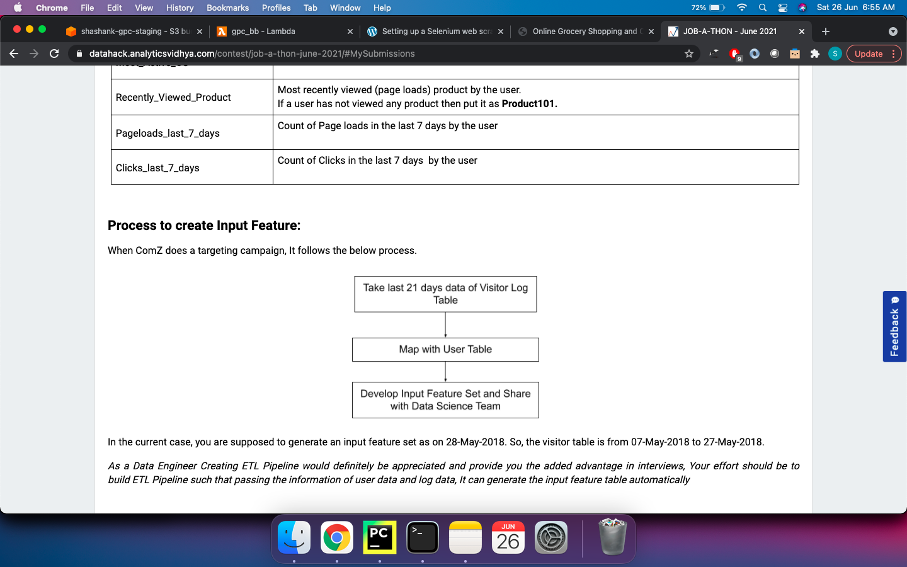

# Solution of JOB-A-THON - June 2021

----
### Hackathon Link

[https://datahack.analyticsvidhya.com/contest/job-a-thon-june-2021/](https://datahack.analyticsvidhya.com/contest/job-a-thon-june-2021/)

----
### Rank
[Leaderboard Rank](https://datahack.analyticsvidhya.com/contest/job-a-thon-june-2021/#LeaderBoard): 70/6400+ Registered Participants

----
### Problem Statement

----
### Approach

Language & Framework Used: Python, Pyspark

* Read the user and visitor logs data
* Normalize “VisitDateTime” column by converting to a single format, and changing the type to “TimestampType”
* Lowercase “ProductID” column. This is done initially because we’ll use the ProductID column to impute missing values of “VisitDateTime”. So to ensure consistency, we’ll convert this column to lowercase.
* Filling the null rows of “VisitDateTime” column by taking the first value of “webClientID” and “ProductID” combination. This won’t be imputing all the null rows, but most of them.
* For the remaining ones, apply the same logic using the “UserID” column.
* Filter visitor logs of only the last 21 days i.e 07-May-2018 to 27-May-2018.
* Fill null values in “Activity” by creating a Window of “webClientID” and taking the lag(previous) value.
* Use the same logic as above to fill the null rows of “ProductID”.
* Convert columns “Activity” and “OS” to lowercase. (To ensure consistency, since we need these in the pipeline output).
* Fill the remaining null values in “Activity” and “ProductID” by creating a Window of “UserID” and taking the first value.
* Compute the output needed by merging the user data with the preprocessed visitor logs data.
